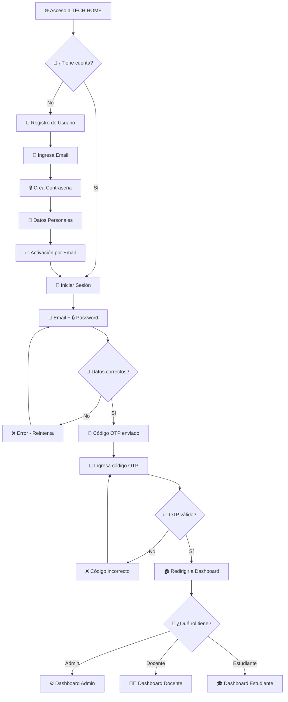
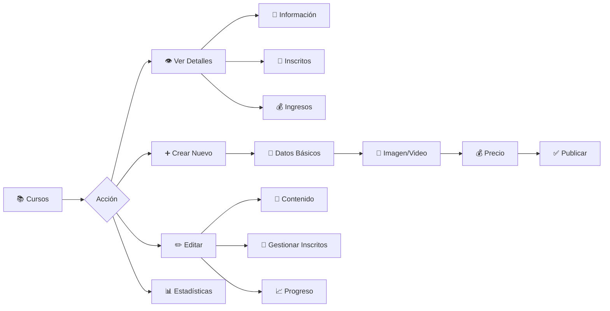
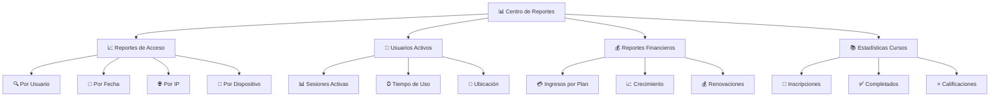
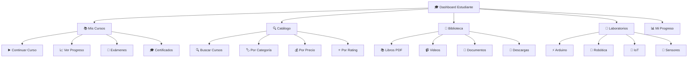
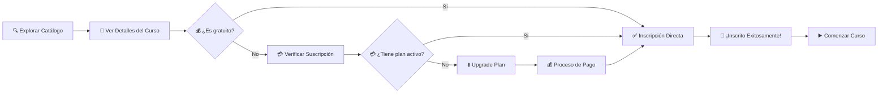
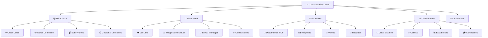
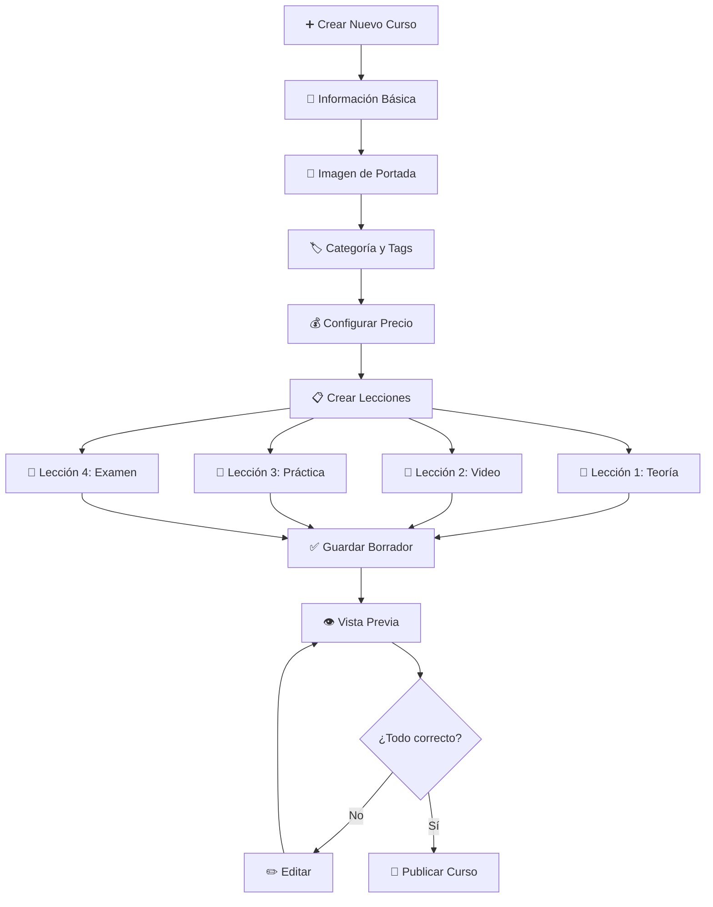
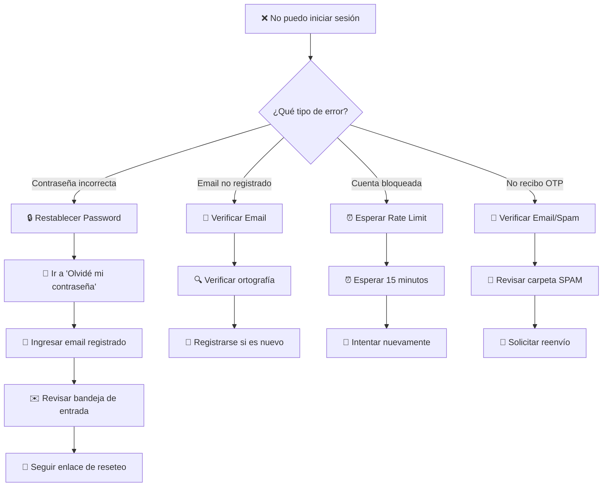

# 📖 MANUAL DE USUARIO - TECH HOME BOLIVIA


---

## 🌐 **SISTEMA DE EDUCACIÓN TECNOLÓGICA**
**Plataforma de gestión de cursos, laboratorios y recursos educativos**

---

## 📋 **TABLA DE CONTENIDOS**

1. [🚀 Introducción](#-introducción)
2. [🔐 Sistema de Autenticación](#-sistema-de-autenticación)
3. [👑 Manual de Administrador](#-manual-de-administrador)
4. [🎓 Manual de Estudiante](#-manual-de-estudiante)
5. [👨‍🏫 Manual de Docente](#-manual-de-docente)
6. [🆘 Solución de Problemas](#-solución-de-problemas)

---

## 🚀 **INTRODUCCIÓN**

TECH HOME Bolivia es una plataforma educativa integral que permite la gestión completa de cursos de tecnología, laboratorios virtuales, materiales educativos y seguimiento del progreso académico.

### **Características Principales:**
- ✅ **Autenticación 2FA** con códigos OTP
- ✅ **Gestión de roles** (Administrador, Docente, Estudiante)
- ✅ **Cursos interactivos** con seguimiento de progreso
- ✅ **Laboratorios virtuales** de electrónica y robótica
- ✅ **Sistema de suscripciones** con diferentes planes
- ✅ **Reportes de acceso** detallados
- ✅ **Biblioteca digital** con recursos descargables

---

## 🔐 **SISTEMA DE AUTENTICACIÓN**

### **Flujo de Acceso al Sistema**



### **Proceso de Login Paso a Paso:**

#### **📧 1. INGRESO DE CREDENCIALES**
```
┌─────────────────────────────────────┐
│  🔐 INICIAR SESIÓN                 │
├─────────────────────────────────────┤
│  📧 Email: [________________]      │
│  🔒 Password: [________________]    │
│                                     │
│  [ 🚀 Iniciar Sesión ]             │
└─────────────────────────────────────┘
```

#### **📱 2. VERIFICACIÓN 2FA**
```
┌─────────────────────────────────────┐
│  📱 VERIFICACIÓN DE SEGURIDAD      │
├─────────────────────────────────────┤
│  Se ha enviado un código de 6       │
│  dígitos a tu email:               │
│  📧 user@example.com               │
│                                     │
│  🔢 Código: [_ _ _ _ _ _]            │
│                                     │
│  [ ✅ Verificar ] [ 🔄 Reenviar ]  │
└─────────────────────────────────────┘
```

#### **⚠️ 3. LÍMITES DE SEGURIDAD**
- **🔐 Login:** Máximo 5 intentos cada 15 minutos
- **📱 OTP:** Máximo 3 intentos cada 5 minutos
- **🔄 Reset Password:** Máximo 3 solicitudes por hora

---

## 👑 **MANUAL DE ADMINISTRADOR**

### **Dashboard Principal**

```mermaid
graph TD
    A[⚙️ Dashboard Admin] --> B[👥 Gestión Usuarios]
    A --> C[📚 Gestión Cursos]
    A --> D[💳 Suscripciones]
    A --> E[📊 Reportes]
    A --> F[🔧 Configuración]

    B --> B0[ ⚙️Acceso total]
    B --> B1[👤 Ver Usuarios]
    B --> B2[➕ Crear Usuario]
    B --> B3[✏️ Editar Usuario]
    B --> B4[🚫 Bloquear/Desbloquear]
    B --> B5[👑 Asignar Roles]
    
    C --> C1[📖 Ver Cursos]
    C --> C2[➕ Crear Curso]
    C --> C3[✏️ Editar Curso]
    C --> C4[📊 Estadísticas]
    
    D --> D1[💰 Ver Suscripciones]
    D --> D2[➕ Nueva Suscripción]
    D --> D3[💳 Cambiar Plan]
    D --> D4[⚠️ Próximas a Vencer]
    
    E --> E1[📈 Accesos]
    E --> E2[👥 Usuarios Activos]
    E --> E3[💰 Ingresos]
    E --> E4[📊 Estadísticas]
```



### **🚀 FLUJO PRINCIPAL DEL ADMINISTRADOR**

#### **1. 👥 GESTIÓN DE USUARIOS**

```
📊 PANEL DE USUARIOS
┌────────────────────────────────────────────────────┐
│  🔍 [Buscar usuario...] [🔽Rol] [🔽Estado]        │
├────────────────────────────────────────────────────┤
│  📊 ESTADÍSTICAS                                   │
│  👥 Total: 1,234  ✅ Activos: 1,180  🚫 Bloqueados: 54  │
└────────────────────────────────────────────────────┘

📝 TABLA DE USUARIOS
┌─────┬──────────────┬──────────────┬──────────┬─────────────┐
│ ID  │ NOMBRE       │ EMAIL        │ ROL      │ ACCIONES    │
├─────┼──────────────┼──────────────┼──────────┼─────────────┤
│ 001 │ Juan Pérez   │ juan@mail.co │ Estudiante│ ✏️ 🗑️ 👑   │
│ 002 │ Ana García   │ ana@mail.com │ Docente   │ ✏️ 🗑️ 🚫   │
│ 003 │ Luis Torres  │ luis@mail.co │ Admin     │ ✏️ 👑      │
└─────┴──────────────┴──────────────┴──────────┴─────────────┘
```

**Acciones Disponibles:**
- ✏️ **Editar:** Modificar datos del usuario
- 🗑️ **Eliminar:** Borrar usuario (confirmación requerida)
- 👑 **Roles:** Asignar/modificar roles y permisos
- 🚫 **Bloquear:** Suspender acceso temporal
- ✅ **Activar:** Restaurar acceso

#### **2. 📚 GESTIÓN DE CURSOS**



#### **3. 💳 GESTIÓN DE SUSCRIPCIONES**

```
💰 PLANES DISPONIBLES
┌─────────────┬─────────────┬──────────────┬─────────────┐
│   BÁSICO    │   PREMIUM   │  PROFESIONAL │   ACCIONES  │
├─────────────┼─────────────┼──────────────┼─────────────┤
│ 💰 $29/mes  │ 💰 $99/trim │ 💰 $299/año  │ ➕ Crear    │
│ 📖 5 Cursos │ 📖 Ilimitado│ 📖 Ilimitado │ ✏️ Editar   │
│ 📱 Soporte  │ 📱 Priority │ 📞 24/7      │ 💳 Cambiar  │
│ Email       │ 🎥 Videos HD│ 🎓 Certificado│ 🗑️ Cancelar │
└─────────────┴─────────────┴──────────────┴─────────────┘

⚠️ PRÓXIMAS A VENCER (7 días)
┌──────────────┬─────────────┬─────────────┬──────────────┐
│ USUARIO      │ PLAN        │ VENCIMIENTO │ ACCIÓN       │
├──────────────┼─────────────┼─────────────┼──────────────┤
│ María López  │ Premium     │ 2025-09-09  │ 🔄 Renovar   │
│ Carlos Ruiz  │ Básico      │ 2025-09-10  │ ⬆️ Upgrade   │
└──────────────┴─────────────┴─────────────┴──────────────┘
```

#### **4. 📊 SISTEMA DE REPORTES**



### **⚙️ CONFIGURACIÓN DEL SISTEMA**

#### **1. 👑 GESTIÓN DE ROLES Y PERMISOS**

```
🎭 CONFIGURACIÓN DE ROLES
┌─────────────────────────────────────────────────────┐
│  ADMINISTRADOR                                      │
│  ✅ admin.dashboard        ✅ admin.usuarios.ver     │
│  ✅ admin.usuarios.crear   ✅ admin.usuarios.editar  │
│  ✅ admin.configuracion    ✅ admin.reportes.ver     │
├─────────────────────────────────────────────────────┤
│  DOCENTE                                            │
│  ✅ docente.dashboard      ✅ docente.cursos.crear   │
│  ✅ docente.materiales     ✅ docente.calificaciones │
├─────────────────────────────────────────────────────┤
│  ESTUDIANTE                                         │
│  ✅ estudiantes.dashboard  ✅ cursos.ver             │
│  ✅ cursos.inscribirse     ✅ materiales.descargar   │
└─────────────────────────────────────────────────────┘
```

---

## 🎓 **MANUAL DE ESTUDIANTE**

### **Dashboard del Estudiante**



### **🚀 FLUJO DEL ESTUDIANTE**

#### **1. 📚 INSCRIPCIÓN EN CURSOS**



#### **2. 📖 EXPERIENCIA DE APRENDIZAJE**

```
🎓 INTERFAZ DEL CURSO
┌─────────────────────────────────────────────────────┐
│  📚 ROBÓTICA DESDE CERO                   75% ████▒ │
├─────────────────────────────────────────────────────┤
│  📋 CONTENIDO DEL CURSO                             │
│  ✅ 1. Introducción                                 │
│  ✅ 2. Componentes Básicos                          │
│  ▶️ 3. Programación Arduino     ← ACTUAL            │
│  ⏸️ 4. Sensores y Actuadores                        │
│  ⏸️ 5. Proyecto Final                               │
├─────────────────────────────────────────────────────┤
│  🎥 VIDEO: "Programación básica Arduino"           │
│  ⏯️ [▶️] ⏸️ ⏹️ ⏮️ ⏭️           🔊 ████▒  15:32/45:20 │
│                                                     │
│  📝 NOTAS PERSONALES:                               │
│  [Escribe tus notas aquí...]                       │
│                                                     │
│  [ 📝 Tomar Examen ] [ 📄 Descargar Material ]     │
└─────────────────────────────────────────────────────┘
```

#### **3. 🧪 LABORATORIOS VIRTUALES**

```
⚡ LABORATORIO ARDUINO
┌─────────────────────────────────────────────────────┐
│  🔧 HERRAMIENTAS DISPONIBLES                        │
│  ┌─────┬─────┬─────┬─────┬─────┬─────┬─────────┐    │
│  │ LED │ BTN │DHT22│SERVO│BUZZ │RELE │ ARDUINO │    │
│  └─────┴─────┴─────┴─────┴─────┴─────┴─────────┘    │
├─────────────────────────────────────────────────────┤
│  🖥️ SIMULADOR                                       │
│  ┌─────────────────────────────────────────────┐    │
│  │        [🟢]     ╔══════════╗                 │    │
│  │         │       ║ ARDUINO  ║                 │    │
│  │        LED      ║    UNO   ║                 │    │
│  │                 ║          ║                 │    │
│  │     [BUTTON]    ╚══════════╝                 │    │
│  └─────────────────────────────────────────────┘    │
├─────────────────────────────────────────────────────┤
│  📝 CÓDIGO:                                         │
│  void setup() {                                     │
│    pinMode(13, OUTPUT);                             │
│  }                                                  │
│  void loop() {                                      │
│    digitalWrite(13, HIGH);                          │
│    delay(1000);                                     │
│  }                                                  │
│                                                     │
│  [ ▶️ Ejecutar ] [ 💾 Guardar ] [ 📤 Enviar ]      │
└─────────────────────────────────────────────────────┘
```

---

## 👨‍🏫 **MANUAL DE DOCENTE**

### **Dashboard del Docente**



### **🚀 FLUJO DEL DOCENTE**

#### **1. 📚 CREACIÓN DE CURSOS**



#### **2. 📊 GESTIÓN DE ESTUDIANTES**

```
👥 PANEL DE ESTUDIANTES
┌─────────────────────────────────────────────────────┐
│  📚 CURSO: Robótica desde Cero                      │
│  👥 Inscritos: 45 estudiantes                       │
├─────────────────────────────────────────────────────┤
│  📊 PROGRESO GENERAL                                │
│  ████████▒▒ 82% Promedio de completado             │
│                                                     │
│  🎯 ESTADÍSTICAS RÁPIDAS                            │
│  ✅ Completaron: 15 (33%)                           │
│  📚 En progreso: 25 (56%)                           │
│  ⏸️ Sin iniciar: 5 (11%)                            │
└─────────────────────────────────────────────────────┘

📋 LISTA DE ESTUDIANTES
┌──────────────┬─────────┬────────────┬──────────────┐
│ ESTUDIANTE   │ PROGRESO│ ÚLTIMA VEZ │ ACCIONES     │
├──────────────┼─────────┼────────────┼──────────────┤
│ Ana García   │ ████████│ Hoy 14:30  │ 📧 💬 📊    │
│ Luis Pérez   │ ██████▒▒│ Ayer       │ 📧 💬 📊    │
│ Carmen Silva │ ███▒▒▒▒▒│ 3 días     │ 📧 💬 ⚠️    │
│ José Torres  │ ████████│ Hoy 09:15  │ 📧 💬 🎓    │
└──────────────┴─────────┴────────────┴──────────────┘
```

#### **3. 📝 SISTEMA DE CALIFICACIONES**

```
📊 CENTRO DE CALIFICACIONES
┌─────────────────────────────────────────────────────┐
│  📚 CURSO: Programación Arduino                     │
│  📝 EXAMEN: Quiz Módulo 3 - Sensores                │
├─────────────────────────────────────────────────────┤
│  🎯 ESTADÍSTICAS                                    │
│  📊 Promedio: 8.5/10                               │
│  ✅ Aprobados: 38/42 (90%)                         │
│  ❌ Reprobados: 4/42 (10%)                         │
└─────────────────────────────────────────────────────┘

📋 CALIFICACIONES INDIVIDUALES
┌──────────────┬──────────┬─────────┬─────────────────┐
│ ESTUDIANTE   │ PUNTUACIÓN│ ESTADO  │ ACCIONES        │
├──────────────┼──────────┼─────────┼─────────────────┤
│ María López  │ 9.5/10   │ ✅ PASS │ 👁️ Ver Detalles│
│ Juan Pérez   │ 8.0/10   │ ✅ PASS │ 💬 Comentario  │
│ Ana Ruiz     │ 5.5/10   │ ❌ FAIL │ 🔄 Permitir    │
│ Carlos Vega  │ 9.0/10   │ ✅ PASS │ 🎓 Certificar  │
└──────────────┴──────────┴─────────┴─────────────────┘
```

---

## 🆘 **SOLUCIÓN DE PROBLEMAS**

### **❌ PROBLEMAS COMUNES Y SOLUCIONES**

#### **🔐 PROBLEMAS DE LOGIN**



#### **⚠️ ERRORES DE RATE LIMITING**

| **Acción** | **Límite** | **Tiempo de Espera** | **Solución** |
|------------|------------|---------------------|--------------|
| 🔐 Login | 5 intentos | 15 minutos | Verificar credenciales |
| 📱 OTP | 3 intentos | 5 minutos | Solicitar nuevo código |
| 🔄 Reset Password | 3 intentos | 60 minutos | Contactar administrador |

#### **📧 PROBLEMAS CON EMAILS**

```
🔍 CHECKLIST DE VERIFICACIÓN
┌─────────────────────────────────────────────────────┐
│  ✅ ¿Email escrito correctamente?                   │
│  ✅ ¿Revisaste la carpeta de SPAM?                  │
│  ✅ ¿Tu servidor de email acepta emails automáticos?│
│  ✅ ¿Hay suficiente espacio en tu buzón?            │
│  ✅ ¿Tu firewall bloquea emails del dominio?       │
└─────────────────────────────────────────────────────┘

🚨 SI PERSISTEN LOS PROBLEMAS:
📞 Contacta al administrador del sistema
📧 Proporciona tu email registrado
🕒 Indica la hora exacta del problema
```

#### **🔧 ERRORES TÉCNICOS**

**Error 404 - Página no encontrada:**
```
❌ Error 404
┌─────────────────────────────────────┐
│  🔗 Verifica la URL                │
│  🔄 Actualiza la página            │
│  🏠 Regresa al dashboard           │
│  📧 Reporta el enlace roto         │
└─────────────────────────────────────┘
```

**Error 403 - Sin permisos:**
```
🚫 Acceso Denegado
┌─────────────────────────────────────┐
│  👑 Verifica tu rol de usuario     │
│  🔐 Confirma que tu sesión esté    │
│      activa                        │
│  📧 Solicita permisos al admin     │
└─────────────────────────────────────┘
```

**Error 500 - Error del servidor:**
```
⚠️ Error Interno
┌─────────────────────────────────────┐
│  🔄 Refresca la página             │
│  ⏰ Espera unos minutos            │
│  📧 Reporta el error al admin      │
│  💾 Guarda tu trabajo             │
└─────────────────────────────────────┘
```

---

### **📞 CONTACTO Y SOPORTE**

```
🆘 CANALES DE SOPORTE
┌─────────────────────────────────────────────────────┐
│  📧 Email: soporte@techhomebolivia.com              │
│  📞 Teléfono: +591 7X XXX-XXXX                     │
│  💬 Chat en línea: 08:00 - 18:00 (Lun-Vie)        │
│  🌐 Portal web: www.techhomebolivia.com/soporte    │
└─────────────────────────────────────────────────────┘

⏰ TIEMPOS DE RESPUESTA
├─ 🚨 Crítico: 2 horas
├─ ⚠️ Alto: 4 horas  
├─ 📋 Normal: 24 horas
└─ 💡 Consulta: 48 horas
```

### **📚 RECURSOS ADICIONALES**

- 📖 **Base de Conocimientos:** Artículos y tutoriales
- 🎥 **Videos Tutoriales:** Canal de YouTube oficial
- 👥 **Comunidad:** Foro de estudiantes y docentes
- 📱 **App Móvil:** Disponible en Play Store (próximamente)

---

### **🔄 ACTUALIZACIONES DEL MANUAL**

| **Versión** | **Fecha** | **Cambios** |
|-------------|-----------|-------------|
| 2.0 | 2025-09-02 | Manual completo con diagramas |
| 1.5 | 2025-08-15 | Agregado sistema de suscripciones |
| 1.0 | 2025-07-01 | Versión inicial |

---

**© 2025 TECH HOME BOLIVIA - Todos los derechos reservados**

